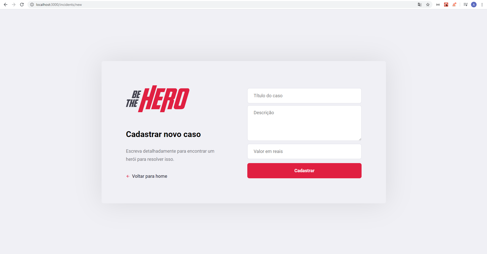

# Be the Hero

Aqui você conecta vidas que precisam de ajuda a super heróis dispostos a ajudar!

## O que é a Be the Hero?

A Be the Hero é uma plataforma que ajuda a conectar ONGs com pessoas dispostas a ajudar. A ONG registra seus casos no sistema e por meio de um aplicativo, qualquer pessoa poderá ver os casos e sentir no coração de ajudar, pode entrar em contato com  ONG via email ou WhatsApp.

## Tecnologias utilizadas no projeto

* HTML, CSS e JavaSCript.
* [React](https://pt-br.reactjs.org/) - no frontend.
* [React Native](https://reactnative.dev/) - para a aplicação mobile.
* [nodejs](https://nodejs.org/en/) - no backend.
* [KnexJS](http://knexjs.org/) - como um banco de dados SQLite.

## Como Funciona

### A ONG realizará seu cadastro na aplicação web e assim que finalizar o cadastro terá seu ID de acesso ao sistema.

* Tela de cadastro de ONG;

* Tela de Login

 

### Assim que a ONG acessar o sistema podera ter aceso a todos os casos registrados e se assim quiser excluir casos que ja foram solucionados. Também tem um botão para a criação de um novo caso.

* Tela de casos;

* Tela de cadastro de casos;

### No Aplicativo mobile os usuários poderão ver os casos cadastrados e se sentirem dispostos a ajudar, poderão entrar em contato via e-mail ou WhatasApp.

* Tela de casos e tela de detalhamento do caso.

